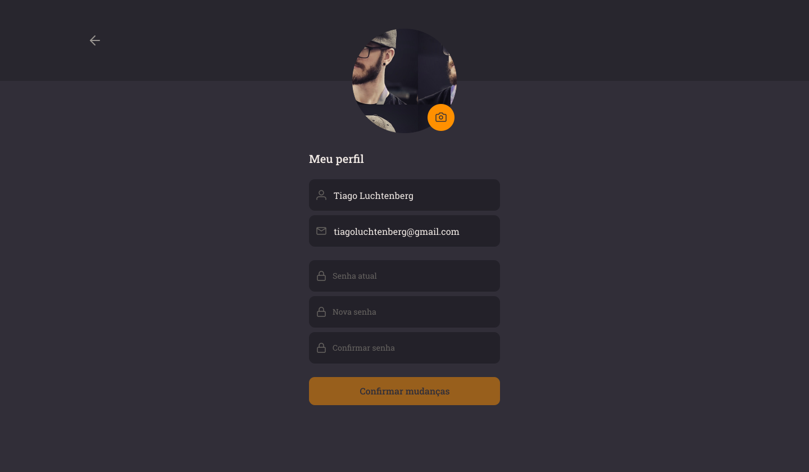
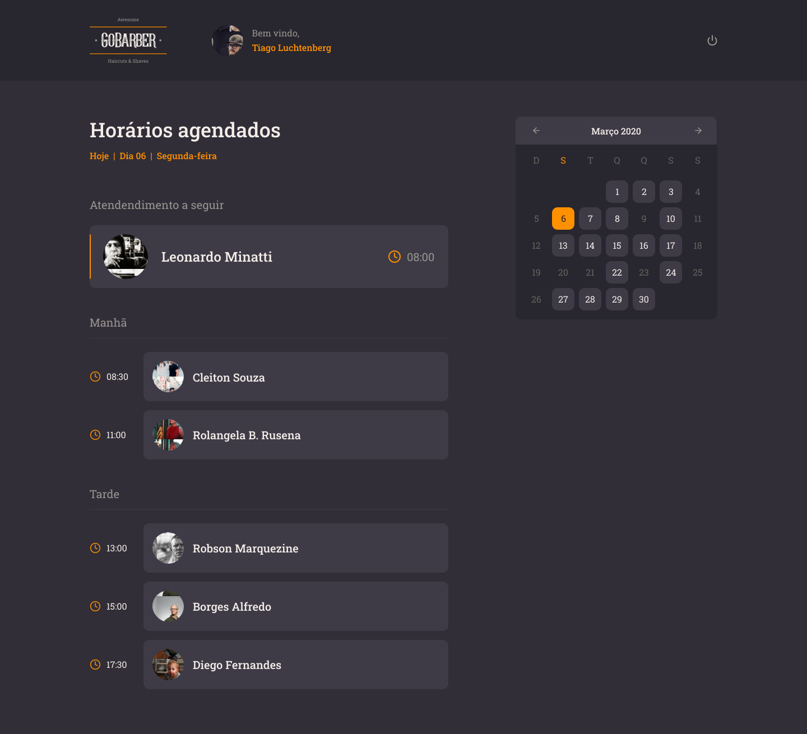
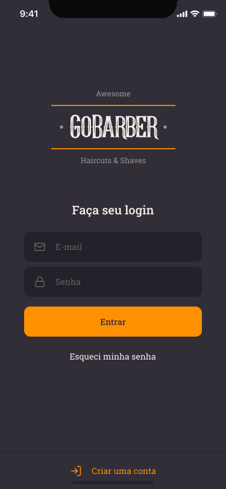
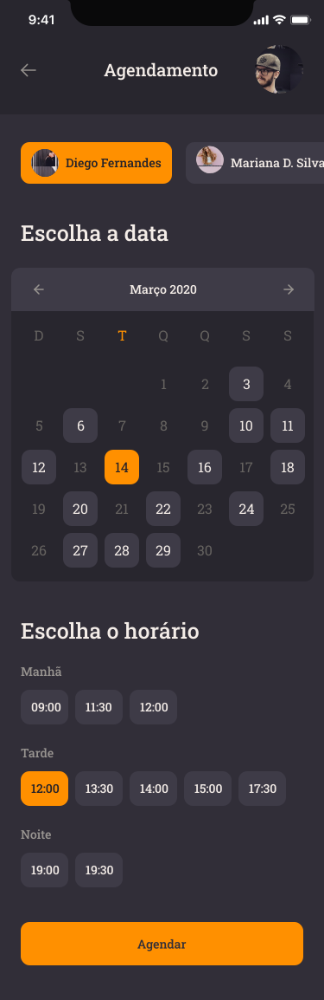
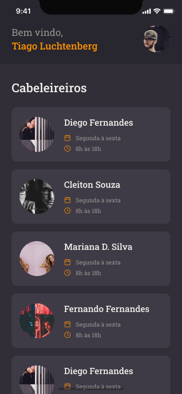

<h1 align="center">
    
    <br>
    GoBarber
    <br>
    
    
    
    
</h1>

<div align="center">
    <h4 style="margin-bottom: 0;"> 🏁  Finished.  🏁</h4>
    <h5 style="margin-top: 0;">(for now)</h5>
</div>

<p align="center">GoBarber is a project developed at the GoStack bootcamp of Rocketseat company using Node.js, React and React Native.</p>

<p align="center">
 <a href="#-goal">Goal</a> •
 <a href="#-layout">Layout</a> • 
 <a href="#-features">Features</a> • 
 <a href="#-requirements">Requirements</a> • 
 <a href="#%EF%B8%8F-runing-project-%EF%B8%8F">Running project</a> • 
 <a href="#-technologies">Technologies</a> • 
 <a href="#%EF%B8%8F-author">Author</a>
</p>

## 🎯 Goal

<p align="center">GoBarber is a projectdeveloped to help barbers to manage their appointments with customers and at the same time enable customers to create appointments with the barbers.</p>

## 🎨 Layout
### 🕸 Web

<div align="center">
    
    
</div>

<div align="center">
    
    
</div>

### 📱 Mobile

<div align="center">
    
    
    
</div>

## 🎩 Features

### User
- [x] Customer/Barber register
- [x] JWT authentication
- [x] Show profile
- [x] Update avatar
- [x] Update profile

### Password
- [x] Password recovery mail
- [x] Password reset

### Appointments
- [x] Create appointment
- [x] List barber appointments
- [x] List barbers
- [x] List barbers availability by month
- [x] List barbers availability by day

## 👨🏻‍🔬 Requirements

Before we begin, you'll need to have the following dependencies installed:
[Git](https://git-scm.com), [Node.js](https://nodejs.org/en/) and [Yarn](https://yarnpkg.com/).
Besides, it would be great that you have a code editor to work on this project, such as [VSCode](https://code.visualstudio.com/).

## 🏃‍♀️ Runing project 🏃‍♂️

### ⚠️ Attention ⚠️ ###
#### To run the mobile app It's important that you change te 'baseURL' value to your IP address in [this](mobile/src/services/api.ts) file.

### 🕵️‍♀️ Hint 🕵️‍♂️ ###
#### You can also access the Insomnia file below to check for api features and how to use them.
<p align="center">
    <a href="assets/insomnia/Insomnia-gobarber.json">
        
    </a>
</p>

```bash
#### Start sever ####

# Clone the repo
$ git clone <https://github.com/thalessarubbi/GoBarber.git>

# Access project folder from a terminal
$ cd GoBarber

# Go to api folder
$ cd api

# Install dependencies
$ yarn

# run api on dev mode
$ yarn dev:server

# The server will start at port :3333 - access <http://localhost:3333>


#### Start web app ####

# Access project folder from a terminal
$ cd GoBarber

# Go to web folder
$ cd web

# Install dependencies
$ yarn

# run web ap on dev mode
$ yarn start

# The web app will start at port :3000 - access <http://localhost:3000>


#### Start mobile app ####

# Access project folder from a terminal
$ cd GoBarber

# Go to mobile app folder
$ cd mobile

# Install dependencies
$ yarn

# run mobile app on iOS emulator(you'll need to be on a MacOS)
$ yarn start ios

# run mobile app on android emulator
$ yarn start android

# The mobile app will start in an emulator
```

## 🛠 Technologies

- [Node.js](https://nodejs.org/en/)
- [React](https://pt-br.reactjs.org/)
- [React Native](https://reactnative.dev/)
- [TypeScript](https://www.typescriptlang.org/)
- [Postgres](https://www.postgresql.org/)
- [MongoDB](https://www.mongodb.com/)
- [Redis](https://redis.io/)
- [TypeORM](https://typeorm.io/#/)
- [Axios](https://github.com/axios/axios)
- [styled-components](https://github.com/axios/axios)
- [VS Code](https://code.visualstudio.com/) with [EditorConfig](https://marketplace.visualstudio.com/items?itemName=EditorConfig.EditorConfig) and [ESLint](https://marketplace.visualstudio.com/items?itemName=dbaeumer.vscode-eslint)

## ✍️ Author
---
<br />

<br />
<sub><b>Thales Sarubbi</b></sub>


Made with 💙 by Thales Sarubbi 🗣 Let's talk!


[](https://www.linkedin.com/in/thales-sarubbi/) 
[](mailto:thalessarubbi@gmail.com)
